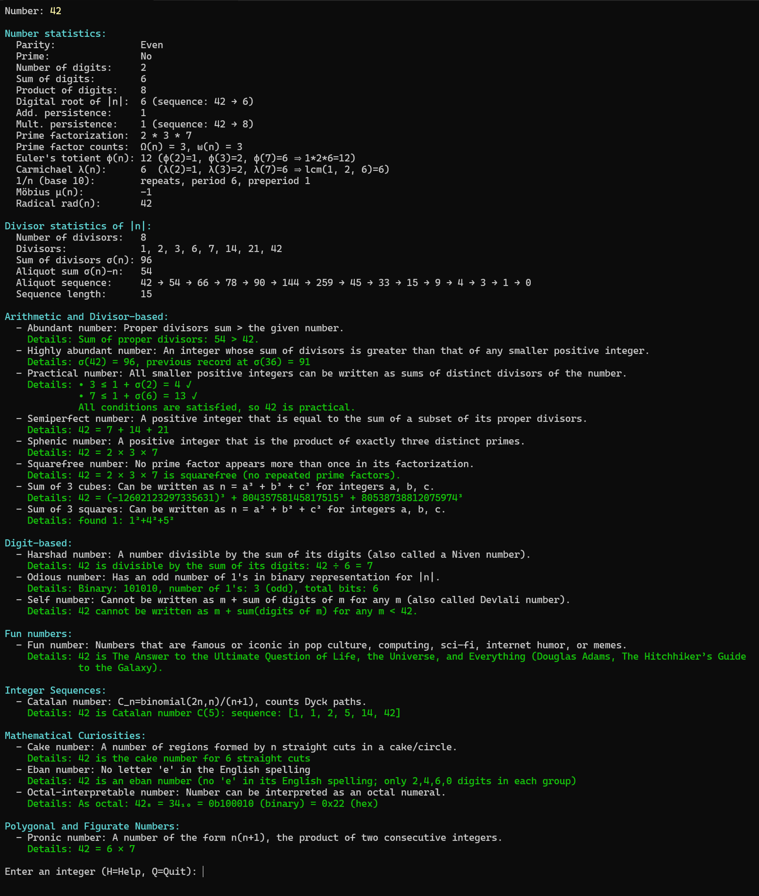

# 🧮 NumClass — A Mathematical X-Ray Scanner for Integers

NumClass is an advanced, extensible number-theory exploration tool.  
It takes a single integer — small or astronomically large — and instantly reveals hundreds of its structural mathematical properties.

Whether you work with recreational mathematics, integer sequences, factorization, aliquot theory, combinatorics, or computational experiments, NumClass acts as a **mathematical X-ray scanner for integers**: you can explore what an integer *is*, how it behaves, and how it connects to the wider universe of number theory.

## 🚀 Features

- **200+ number-theory classifiers**
- **Number and divisor statistics**  
- **Aliquot sequence engine**  
- **Advanced factorization pipeline**  
- **User profiles** for full configurability
- **Efficient intersection logic** (e.g., "Happy palindromic prime")
- **Detailed explanations** for each classification
- **Auto-discovers custom classifiers**: simply add your own!  

### Core Categories:
- **Arithmetic and Divisor-based** such as Perfect, Abundant, Deficient, Powerful, Practical, Sociable, Triperfect, and more.
- **Combinatorial and Geometric** such as Bell, cake numbers, Catalan, Motzkin, Stirling, Ramsey, etc.
- **Conjectures and Equation-based** including Egyptian fractions, Erdős–Straus, Goldbach, Legendre, and others.
- **Digit-based** like Palindrome, Automorphic, Happy, Narcissistic, Self, Kaprekar, etc.
- **Diophantine representations** — Numbers expressible as sums of squares or cubes.
- **Dynamical Sequences** such as Collatz, Ducci, Fibonacci mod n and Kaprekar routines.
- **Fun Numbers** — notable in pop culture, the internet, computing, or science fiction.
- **Mathematical Curiosities** including Münchausen, Kaprekar constants, strobogrammatic, vampire and Eban numbers.
- **Named Sequences** such as Busy Beaver, Carol, Lucky, Keith, Padovan and Taxicab numbers.
- **Polygonal and Figurate** including Triangular, Pentagonal, Pronic, Cyclic, and Repunit numbers.
- **Primes and Prime-related numbers** including twin, safe, sexy, Sophie Germain, palindromic, emirp, factorial, strong, super primes, and more.
- **Pseudoprimes and Cryptographic numbers** such as Blum, Carmichael, Fermat, and Euler–Jacobi pseudoprimes.

The classification is fast and accurate thanks to algorithmic optimizations and the use of OEIS `bXXXXXX.txt` files for computationally heavy calculations where applicable.  

See the NumClass User Manual in 'docs/' for detailed information, including installation and configuration.

## 🧠 Why?

Because every integer has a story.  
Whether you're a math enthusiast or educator, this tool lets you explore the wild and wonderful world of numbers.

Inspired by [Numberphile](https://www.youtube.com/user/numberphile) and their love of surprising number facts!

## ▶️ Usage

Simply type `numclass` to start interactive mode or use it as command line interface (CLI):   
```numclass [-h] [--output OUTPUT] [--quiet] [--no-details] [--debug] [number]```

- `[number]` Number to classify (if no number is given, launches in interactive mode)

Options:
- `-h`, `--help` Show this help message and exit
- `--output OUTPUT` Output file or directory (see user/settings.py for more info)
- `--quiet` Suppress screen output (for quiet file output)
- `--no-details` Do not show explanation/details for results
- `--debug` Debug mode (including timings)   


## 🔍 Example Output



## 📁 File Structure

```text
numclass/
├── src/
│   └── numclass/
│       ├── classifiers/
│       │   ├── arithmetic_divisor.py
│       │   ├── combinatorial_geometric.py
│       │   ├── conjectures.py
│       │   ├── curiosities.py
│       │   ├── curiosity_constants.py
│       │   ├── digit_based.py
│       │   ├── diophantine.py
│       │   ├── dynamical_sequences.py
│       │   ├── fun_number.py
│       │   ├── named_sequences.py
│       │   ├── polygonal_figurate.py
│       │   └── …
│       ├── data/
│       │   ├── b000041.txt
│       │   ├── b000108.txt
│       │   ├── …
│       │   ├── curiosity_constants.tsv
│       │   ├── erdos_woods.toml
│       │   ├── fun_numbers.tsv
│       │   ├── hard_factors.txt
│       │   ├── intersections.toml
│       │   ├── special_inputs.tsv
│       │   └── sum_of_three_cubes.toml
│       ├── profiles/
│       │   ├── default.toml
│       │   ├── all.toml
│       │   └── …
│       ├── classify.py
│       ├── cli.py
│       ├── config.py
│       ├── context.py
│       ├── dataio.py
│       ├── display.py
│       ├── expreval.py
│       ├── fmt.py
│       ├── intersections.py
│       ├── output_manager.py
│       ├── progress.py
│       ├── registry.py
│       ├── runtime.py
│       ├── transform.py
│       ├── utility.py
│       ├── workspace.py
│       ├── __main__.py
│       └── __init__.py
├── tests/
│   └── test_numclass.py
├── docs/
│   └── NumClass Manual 1.0 for NumClass 2.0.pdf
├── images/
│   └── output42.jpg
├── CHANGELOG.md
├── CONTRIBUTING.md
├── CODE_OF_CONDUCT.md
├── LICENSE
├── SECURITY.md
├── pyproject.toml
└── README.md
```

## ⚖️ License
[](https://creativecommons.org/licenses/by-nc/4.0/)

NumClass is licensed under the Creative Commons Attribution–NonCommercial
4.0 International License (CC BY-NC 4.0).

It is free for personal, academic, and other non-commercial use with
attribution. Commercial use requires explicit permission from the author.

See `LICENSE` for the full legal text.
